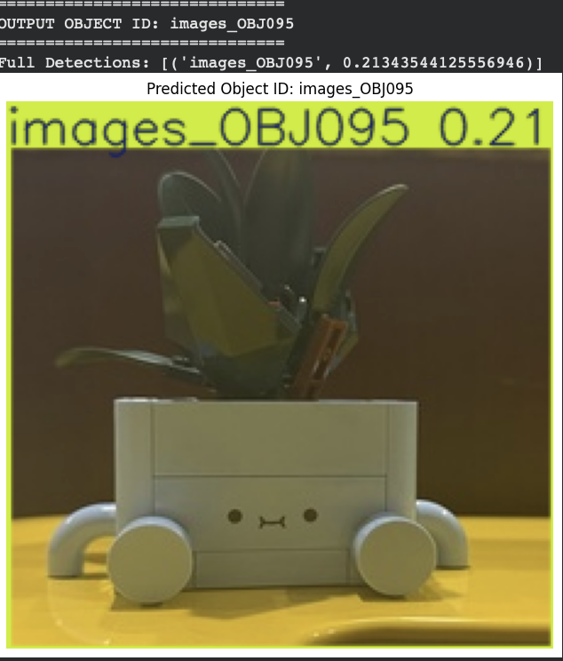
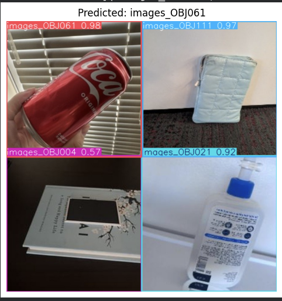
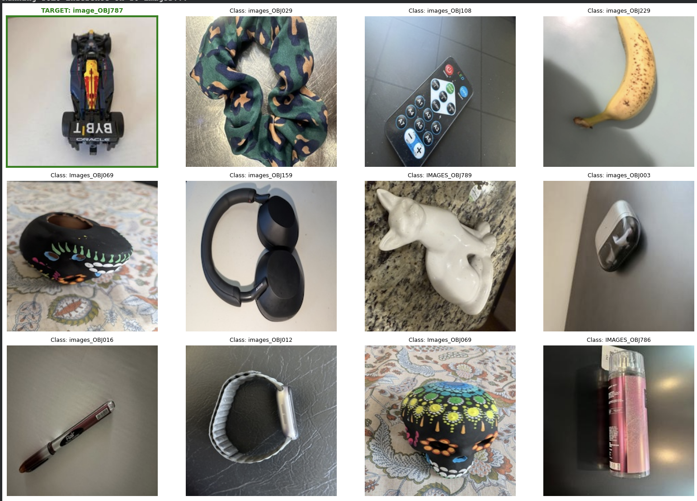
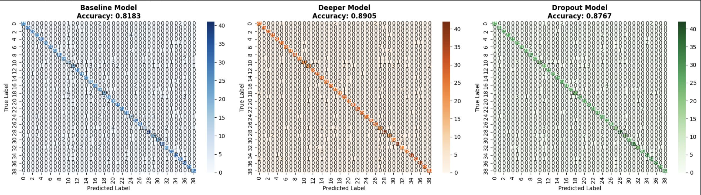
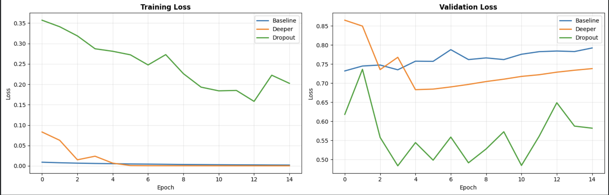

# YOLOv8 Custom Object Detection

## 📌 Project Overview

This project implements object detection using **YOLOv8** on a custom dataset containing approximately **3,900 images**.

The trained model detects objects and generates bounding boxes with confidence scores. The repository includes training results, evaluation metrics, and sample detection outputs.

---

## 📂 Repository Structure
yolov8-object-detection/
│
├── yolov8-Object-Detection.ipynb
├── dataset/
│ └── dataset_sample/
├── outputs/
├── README.md

---

## 📊 Full Dataset

The complete dataset contains approximately **3,900 images**.

Due to GitHub file count limitations, the full dataset is hosted on Google Drive:

👉 [Download Full Dataset Here](https://drive.google.com/drive/folders/14TsN4O5KqlCMsZzhYJmziTUxFBDLwcP5?usp=share_link)

---

## ⚙️ Installation

Install the required dependencies:
pip install -r requirements.txt

---

## ▶️ How to Run

1. Open the notebook in **Google Colab**
2. Install the required libraries
3. Run all cells sequentially
4. Perform object detection on custom images

---

## 🔍 Sample Detection Results

### Object Detection Examples

---

### Model Evaluation

#### Confusion Matrix

#### Training & Validation Accuracy

#### Training & Validation Loss

---

## 📈 Performance Summary

- YOLOv8 model trained on ~3,900 images  
- Model evaluated using confusion matrix and performance metrics  
- Successful object ID detection on unseen test images  
- High-resolution output detection results generated  

---

## 🧠 Skills Demonstrated

- Deep Learning  
- Object Detection (YOLOv8)  
- Computer Vision  
- Model Training & Evaluation  
- Performance Metrics Analysis  
